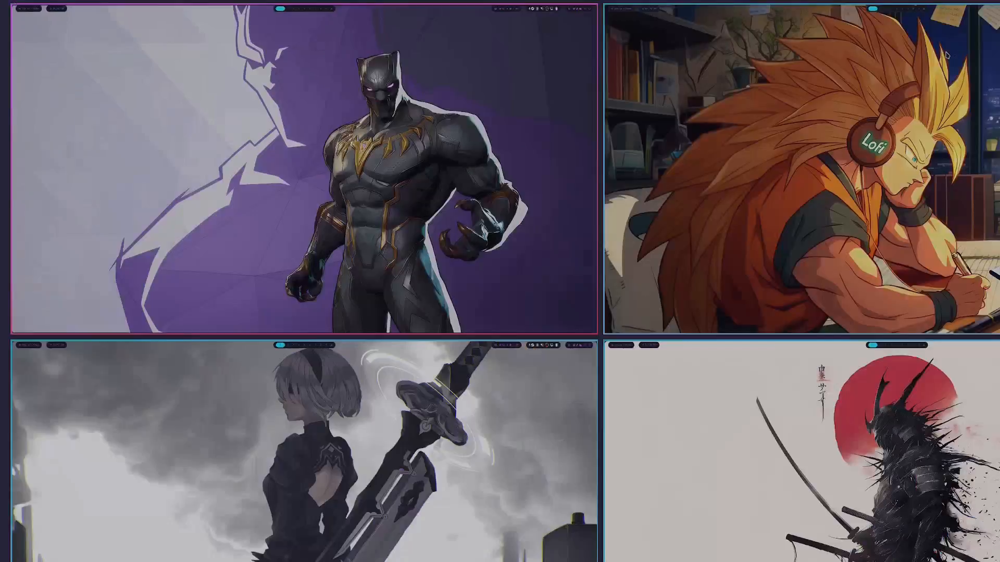

# Hyprland Video Wallpapers

<p align="center">
  
</p>

<p align="center">
  <strong>Per-workspace video wallpapers with pseudo-tiling window management</strong>
</p>

<p align="center">
  
  
  
  
  
</p>

---

## Preview

**Live demo (full experience & autoplay)**:  
👉 [Open interactive demo (GitHub Pages)](https://xclusivvv.github.io/hyprland-video-wallpapers/)

**Quick preview** (click to open MP4 directly):  
[](docs/preview/preview.mp4)

<p align="center"><i>Note: Not recommended for low-spec systems. 16GB RAM minimum is strongly advised.</i></p>

---

## Quick start (Arch Linux)

```bash
git clone https://github.com/XclusivVv/hyprland-video-wallpapers.git
cd hyprland-video-wallpapers

chmod +x install.sh
./install.sh
```

---

## What the installer does

- Verifies `hyprctl` exists (warns if not).  
- Installs runtime deps (`mpv`, `socat`, `jq`) via pacman if available.  
- Copies `hyprland-video-wallpapers.sh` to `~/.local/bin/hyprland-video-wallpapers`.  
- Copies config `hyprland-video-wallpapers.conf` to `~/.config/hypr/`.  
- Creates autostart fragment `~/.config/hypr/workspace-video-autostart.conf`.  
- Optionally comments out `togglefloating` in `keybinds.conf` to prevent conflicts.  

> Does **not** install Hyprland itself — works with any variant (`hyprland`, `hyprland-git`, etc.).

---

## Hyprland configuration

Add **only this line** to your `hyprland.conf`:

```conf
source = ~/.config/hypr/hyprland-video-wallpapers.conf
```

All workspace layouts, master layout settings, and window rules are included in the config file.

---

## Script configuration

Edit `hyprland-video-wallpapers.sh`:

```bash
VIDEO_MAP=(
  "1:/home/you/videos/video1.mp4"
  "2:/home/you/videos/video2.mp4"
  # ...
)

GAP_SIZE=5
TOP_GAP=15
```

Run:

```bash
~/.local/bin/hyprland-video-wallpapers &
```

Stop:

```bash
pkill -f hyprland-video-wallpapers.sh
```

---

## How it works

- MPV is promoted to master tile and pushed to the bottom of the tiled layer (`alterzorder bottom`).  
- All other apps float and are pseudo-tiled via exact geometry dispatchers.  
- Ensures stable video backgrounds per workspace while other apps float on top.  

---

## Files included

- `hyprland-video-wallpapers.sh` — main script  
- `install.sh` — installer  
- `hyprland-video-wallpapers.conf` — configuration file  
- `logo.svg` — project logo  
- `docs/index.html` — GitHub Pages demo  
- `docs/preview/preview.mp4` — demo video  
- `docs/preview/thumbnail.png` — thumbnail for README  

---

## Creating the thumbnail (optional)

```bash
mkdir -p docs/preview
ffmpeg -ss 00:00:05 -i docs/preview/preview.mp4 -frames:v 1 -q:v 2 docs/preview/thumbnail.png
```

---

## GitHub Pages demo

```
https://xclusivvv.github.io/hyprland-video-wallpapers/
```

---

## Troubleshooting

- `hyprctl` not found → Hyprland not installed or not in PATH.  
- MPV not appearing → confirm window title matches `mpv-workspace-video-<ws>` in the script.  

---

## License

MIT — see `LICENSE`.

---

_PS: This was a struggle._
